# Biometric Attendance Management System

## Overview
The **Biometric Attendance Management System** is a C# Windows Forms application built using **.NET Framework 4.8**. It integrates with **SQL Server** for data storage and **Crystal Reports** for reporting.

## Features
- **Employee Management**: Add, update, delete, and search employees.
- **Biometric Machine Management**: Manage biometric devices.
- **Biometric Logs**: Import and process biometric attendance records.
- **Role-Based Login**: Secure authentication with roles (SystemAdmin, Admin, User).
- **Batch Processing**: Group biometric logs into batches for efficient management.
- **Reporting**: Generate reports using **Crystal Reports**.

## Project Modules

### 1. Employee Management
- Employee List (Search, Add, Update, Delete)
- Assign Shift Timings
- Validate Required Fields (Name, Contact, Salary, Shift Timings)

### 2. Biometric Machine Management
- List, Add, Update, Delete biometric machines.

### 3. Biometric Logs
- Import logs from **CSV files**.
- **Bulk Insert** using `SQL MERGE`.
- Duplicate checks before insertion.
- Process logs to determine **IN/OUT timings**.

### 4. Role-Based Authentication
- Users login with **username** and **password**.
- Three roles: **SystemAdmin, Admin, User**.
- Assign permissions based on role.

### 5. Reports (Crystal Reports)
- **Daily Attendance Report** (Employee-wise In/Out Timings & Hours Worked)
- **Monthly Attendance Summary**
- **Batch-wise Log Report**

## Database Structure
The project uses **SQL Server** with key tables:
- `Employees`
- `BiometricMachines`
- `BiometricLogs`
- `LoginUsers`
- `CompanyInfo`

## Screenshots
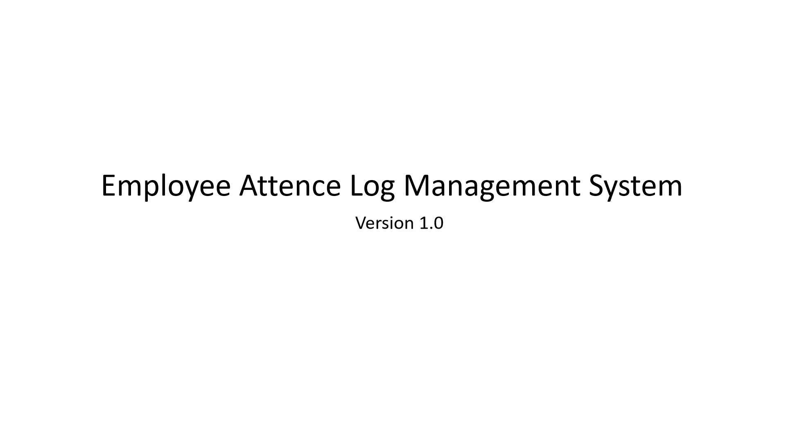
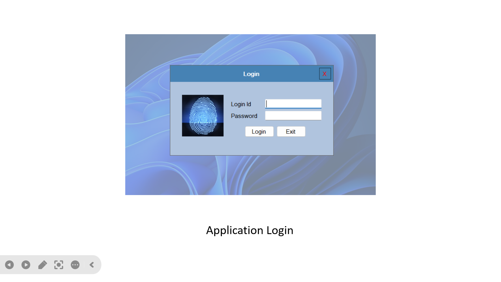
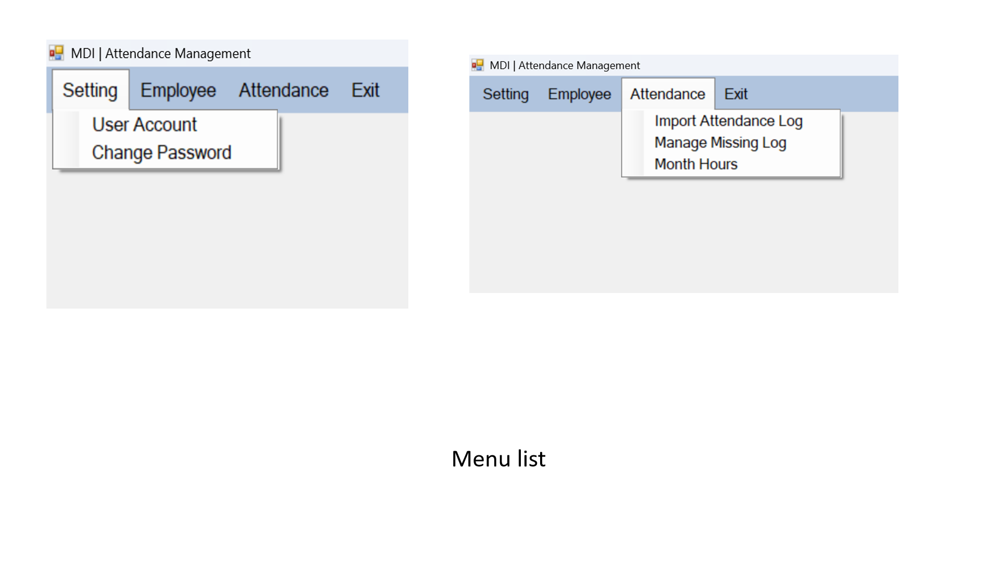
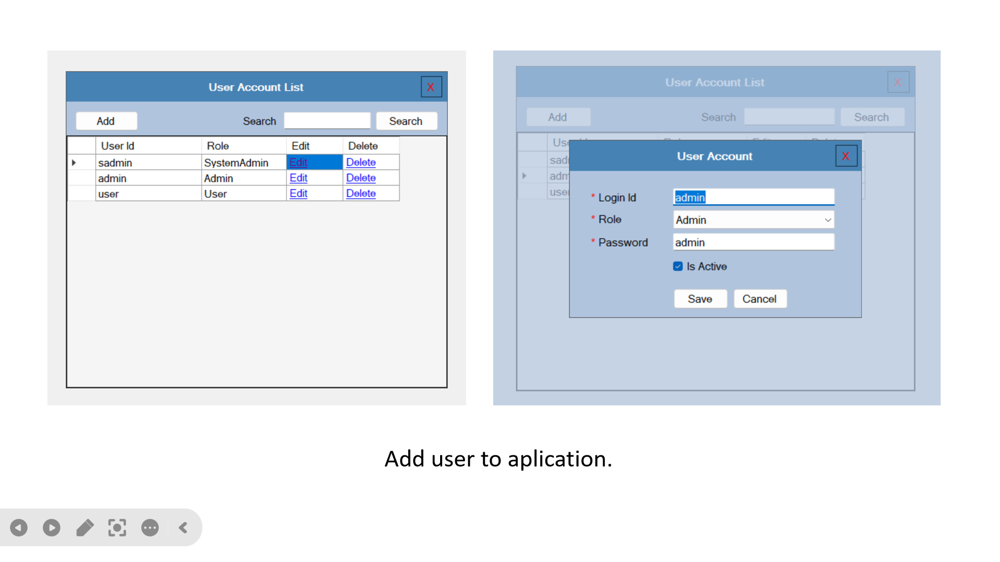
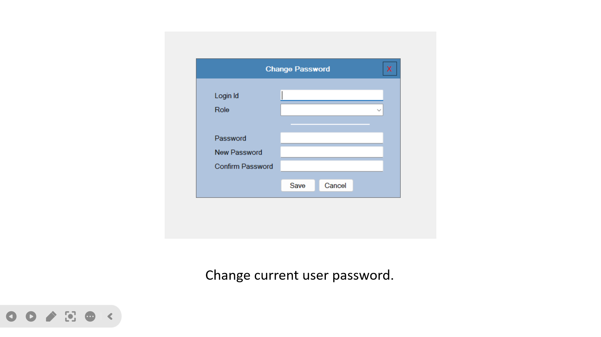
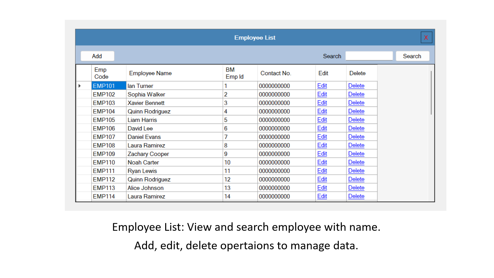
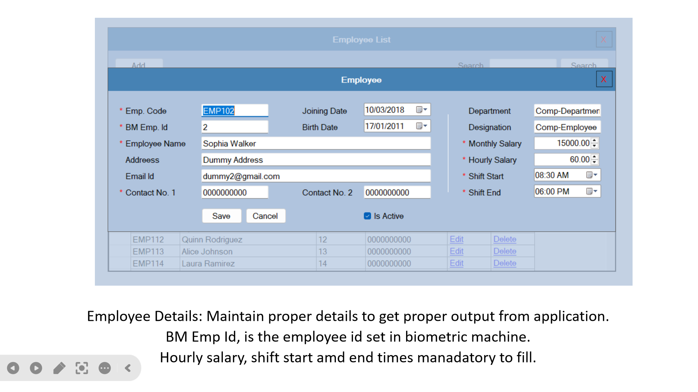
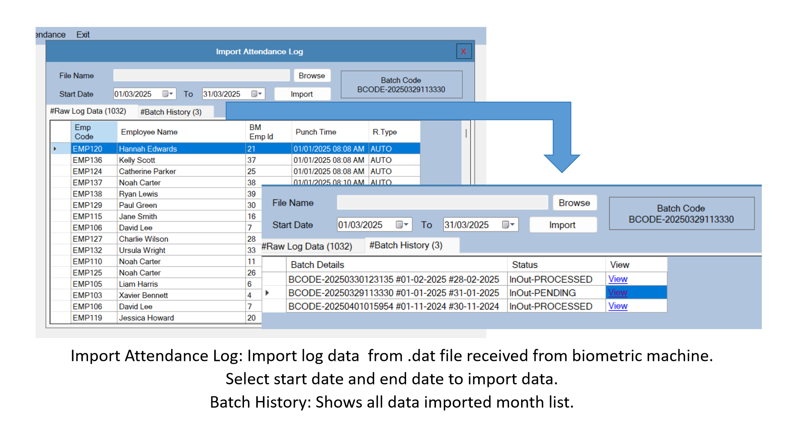
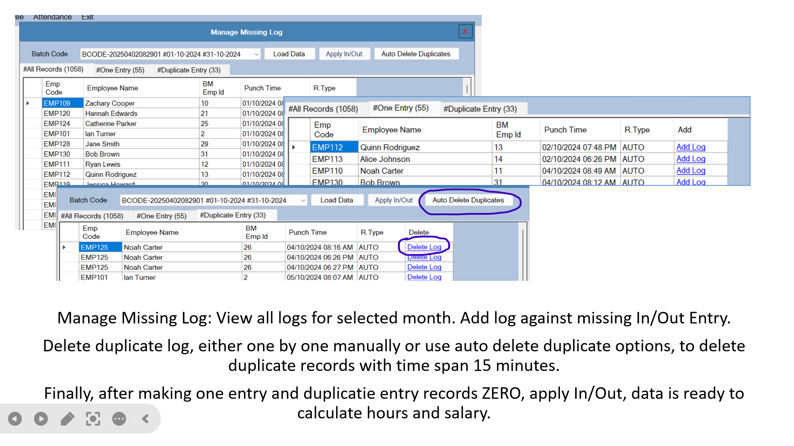
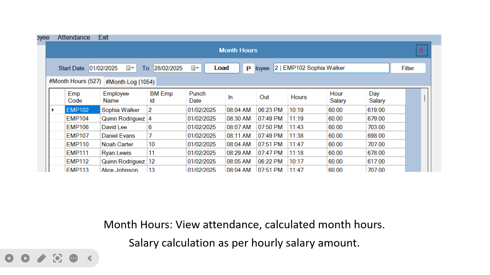
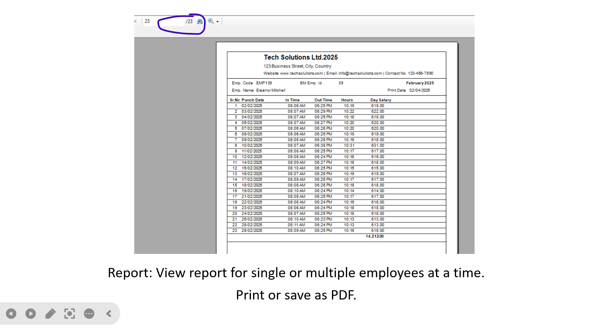

## How to Run
1. Install **.NET Framework 4.8**.
2. Set up **SQL Server** and restore the database.
3. Configure **connection string** in `app.config`.
4. Run the application using **Visual Studio**.

## Future Enhancements
- **Web Version** using ASP.NET Core.
- **Mobile App** for employee self-service.
- **Integration with third-party biometric devices.**

